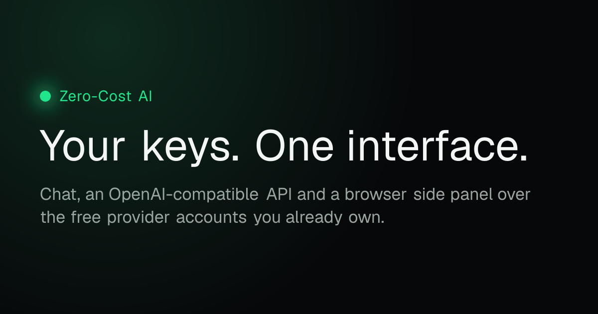
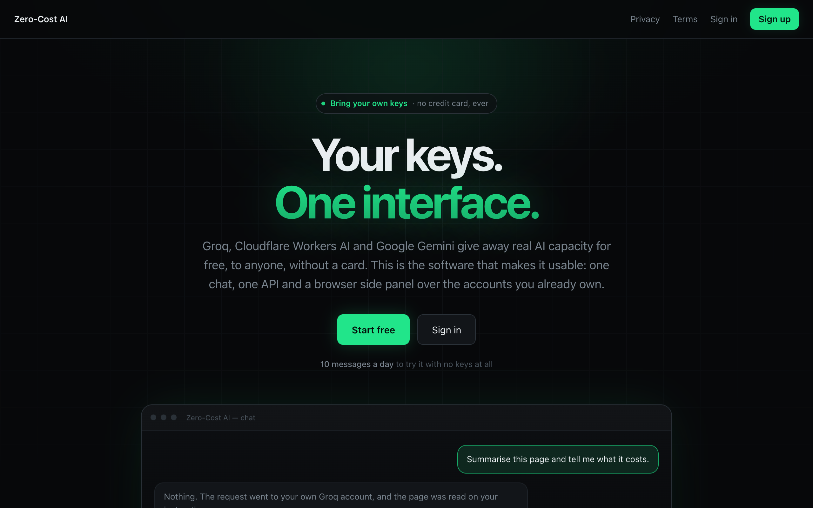
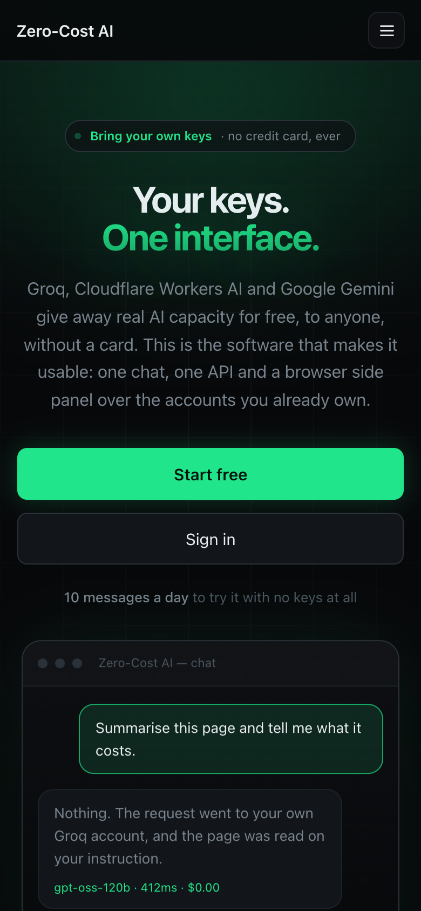
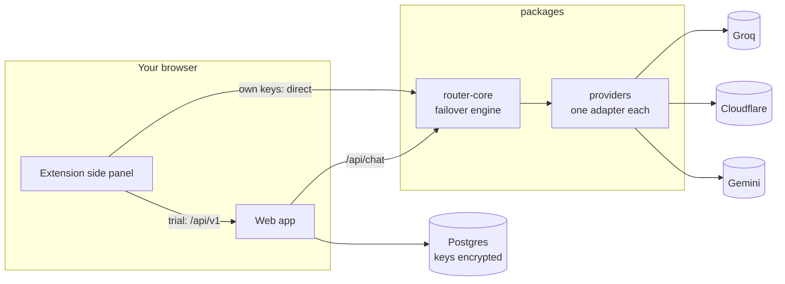

<p align="center">
  
</p>

<p align="center">
  <b>One chat, one OpenAI-compatible API and a browser agent — over the free AI accounts you already own.</b>
</p>

<p align="center">
  <a href="LICENSE"></a>
  
  
  
  
</p>

---

Groq, Cloudflare Workers AI and Google Gemini give away real model capacity to anyone with an
email address — no card, no trial, nothing to cancel. Each has its own console, key format, rate
limit and failure mode. **Zero-Cost AI puts one interface over all of them**, and keeps the
accounts yours.

It is software, not a model provider. You register with the providers yourself, the keys and the
quota are yours, and this is the router, the chat, the browser extension and the API on top.

<table>
  <tr>
    <td width="72%"></td>
    <td></td>
  </tr>
</table>

## What it does

**Routes and fails over.** Eighteen free models across three providers, chosen per message. When
one provider rate-limits you, the next with capacity answers mid-request and the failure is
remembered for a cooldown — you get an answer, not a 429.

**Chats, with history.** Conversations live on your account, so you can continue one on a
different model. Three effort levels cap the reply so a metered free tier is spent deliberately;
models that reason show their thinking small and collapsed, and never spend the answer's budget
on it. Voice input, linked pages read into the conversation, text files attached, images
generated.

**Works in the browser.** A Chrome side panel with its own chat per tab. It can read the page in
front of you — and, in **Act** mode, follow links, fill in fields, pick from menus, press Enter to
search and read what comes back. Anything irreversible waits for you; passwords and card numbers
are never typed. [How that is made safe →](docs/agent.md)

**Speaks OpenAI.** Point any OpenAI SDK at your own endpoint and it runs through the same keys and
the same failover. Your code needs no changes beyond a base URL.

**Keeps your keys to itself.** Provider keys are encrypted with AES-256-GCM under a key that never
enters the database. Usage records hold token counts and timings, never text — a test fails the
build if a content field is ever added.

## Quick start

You need Node 22+, pnpm and Postgres 16.

```bash
pnpm install
cp .env.example apps/web/.env.local
```

Fill in `DATABASE_URL`, then generate the two secrets it asks for:

```bash
node -e "console.log(require('crypto').randomBytes(32).toString('base64'))"
```

Create the schema and start it:

```bash
pnpm db:push && pnpm dev
```

Open <http://localhost:3000>, create an account, and paste a free key under **Settings → Provider
keys**. Groq's takes a minute: <https://console.groq.com/keys>.

### The extension

```bash
pnpm ext
```

That builds it and checks Chrome could load it. In `chrome://extensions`, turn on developer mode,
choose **Load unpacked** and pick `apps/extension/dist` — not `apps/extension`, which is the source.
Open it from the toolbar or with <kbd>Ctrl</kbd>/<kbd>⌘</kbd>+<kbd>Shift</kbd>+<kbd>Y</kbd>.

## Providers

Verified against each provider's own documentation, and against live requests where the docs were
wrong. Sources and dates in [docs/providers.md](docs/providers.md).

| Provider | Card | Models | Keeps what you send |
|---|---|---|---|
| Groq | no | GPT-OSS 120B/20B, Qwen 3.6/3.8, Compound | no |
| Cloudflare Workers AI | no | GPT-OSS 120B, Llama 3.1/3.2/3.3, Mistral Small, QwQ | no |
| Google Gemini | no | Gemini 3.1–3.8 Flash and Flash-Lite | **yes, on the free tier** |

A provider that needs a payment method does not ship, and a test holds that line. Gemini's free
tier is the one exception worth knowing about: Google's terms let it train on what is sent and let
reviewers read it. It is last in failover order, and the warning is shown on the key form and in
the panel at the moment of use.

## How it fits together



`router-core` imports nothing from Node or Next.js. That is why the extension runs the very same
failover engine inside the browser when it calls a provider with your own key — the request goes
from your browser to the provider, and never through this server.

```
packages/
  shared/       types, schemas, response modes, the SSE reader
  providers/    Groq, Cloudflare, Gemini on one OpenAI-compatible helper
  router-core/  the failover state machine and an HTTP handler
  pricing/      dated reference prices for the savings counter
apps/
  web/          Next.js 16: accounts, key vault, chat, settings, API, SEO
  extension/    Manifest V3 side panel, Vite + React, and the page agent
docs/           verification logs and design notes
store/          Chrome Web Store listing and publishing guide
```

## Documentation

| | |
|---|---|
| [docs/features.md](docs/features.md) | Every feature in depth — reading the web, images, the API, voice, the savings counter, accounts, rate limits |
| [docs/agent.md](docs/agent.md) | The browser agent: what a step costs, the safety rules and how they were measured |
| [docs/providers.md](docs/providers.md) | What was verified about each provider, when, and against what |
| [DECISIONS.md](DECISIONS.md) | Where the build departs from its brief, and why |
| [store/PUBLISHING.md](store/PUBLISHING.md) | Deploying the site and publishing the extension |
| [SECURITY.md](SECURITY.md) | Reporting a vulnerability |
| [CONTRIBUTING.md](CONTRIBUTING.md) | Running the checks, and the rules a change must keep |

## Development

```bash
pnpm lint          # Biome: lint and formatting
pnpm typecheck     # tsc across every package
pnpm test          # unit tests; integration tests skip without a database
pnpm test:db       # everything, against postgres://localhost:5432/zca_dev
pnpm ext           # build the extension and verify Chrome could load it
```

About 420 tests. CI runs lint, typecheck, the full suite against a Postgres container, and both
production builds on every push.

## Licence

MIT — see [LICENSE](LICENSE).
